<div align="center">

</div>

<br/>

<div align="center">

[](https://git.io/typing-svg)

<br/>


[](mailto:ahlamghribi77@gmail.com)

</div>

---

<div align="center">

```
┌──────────────────────────────────────────────────────────────────────┐
│                                                                      │
│  " I write code that works.  I design things that feel right.        │
│    I secure systems others forget to protect.                        │
│    I don't just ship features — I build things I'm proud of. "      │
│                                                                      │
└──────────────────────────────────────────────────────────────────────┘
```

</div>

---

## 🧬 &nbsp; About Me

I'm a **Full-Stack Developer** and **Cybersecurity Engineer** based in Algeria — working across the full spectrum of the web. I design, build, secure, and ship.

I've delivered production-grade projects for clients in **Algeria, France, the USA, and Canada** — from e-learning platforms and travel agencies to AI marketing sites and accreditation systems. Each one built from scratch, with care.

```
  Engineering  ×  Design  ×  Security
```

- 🖥️ &nbsp; **Frontend** — React, Three.js, Vanilla JS, CSS animations, WebGL, Canvas API
- ⚙️ &nbsp; **Backend** — Node.js, Django, PHP, REST APIs, databases, auth systems
- 🛡️ &nbsp; **Cybersecurity** — Security hardening, firewall config, SSL/TLS, OWASP, pentesting
- 🎨 &nbsp; **UI/UX** — Figma-first design, motion design, responsive systems
- ☁️ &nbsp; **DevOps** — Docker, AWS, Cloudflare, Firebase, cPanel
- 📊 &nbsp; **Marketing** — SEO, Google Analytics, Ads, conversion optimization

---

## ⚙️ &nbsp; Tech Stack

<div align="center">

**— LANGUAGES —**


**— FRONTEND & 3D —**


**— BACKEND & DATABASE —**


**— SECURITY —**


**— DEVOPS & CLOUD —**


**— DESIGN —**


**— CMS & MOBILE —**


**— SEO & MARKETING —**


</div>

---

## 🗂️ &nbsp; Selected Work

> *Real clients. Real products. Real impact. Every project built from scratch.*

<br/>

<table>
<tr>
<td width="50%" valign="top">

### 🧠 Strategix AI — Marketing Agency
**→ [ai.strategixs.net](https://ai.strategixs.net)** &nbsp; `France 🇫🇷`

Full build for a French AI marketing agency. Custom Elementor + surgical CSS overrides, AI-powered lead gen plugins, Cloudflare SSL + caching architecture.

`WordPress` `Elementor Pro` `Cloudflare` `AI Plugins` `SEO`

</td>
<td width="50%" valign="top">

### 🎓 Kost Formation Métiers
**→ [metiers.kostacademy.com](https://metiers.kostacademy.com)** &nbsp; `Algeria 🇩🇿`

Full e-learning academy from domain to deployment. LearnPress LMS, multilingual content, responsive layout, speed optimization, full SEO architecture.

`LearnPress LMS` `WordPress` `WPML` `SEO` `Cloudflare`

</td>
</tr>
<tr>
<td width="50%" valign="top">

### 🌍 Future Caravans — Event Platform
**→ [futurecaravans.com](https://futurecaravans.com)** &nbsp; `Algeria · 7 wilayas`

Figma design → WordPress build. Algeria's top financial literacy caravan, 3rd edition. Custom CSS, event booking, mobile-first performance.

`Figma → Code` `Custom CSS` `Event Booking` `Mobile`

</td>
<td width="50%" valign="top">

### ✈️ TripSun — Travel Agency
**→ [trip-sun.com](https://trip-sun.com)** &nbsp; `Algeria 🇩🇿`

WooCommerce booking + product management. Sub-3s load on image-heavy content. SEO top-ranked.

`WooCommerce` `Elementor Pro` `LWS` `Cloudflare` `SEO`

</td>
</tr>
<tr>
<td width="50%" valign="top">

### 🏢 American Prograde Academy
**→ [apgaccreditation.com](https://apgaccreditation.com)** &nbsp; `USA 🇺🇸`

Membership + accreditation system from zero. Custom payment forms, onboarding UX, security hardening, firewall, DB optimization.

`Membership` `Payment Gateway` `Security` `US Hosting`

</td>
<td width="50%" valign="top">

### ✈️ Experter — Canada Immigration
**→ [im.experter.ca](https://im.experter.ca)** &nbsp; `Canada 🇨🇦`

Built in Framer. 3D transitions, scroll storytelling, motion design. Every interaction designed to build trust and drive conversion.

`Framer` `3D Transitions` `Motion Design` `Brand Story`

</td>
</tr>
<tr>
<td width="50%" valign="top">

### 💎 Strategix Landing Pages
**→ [View Repo](https://github.com/Ahlamghribi/landing-page-strategixs-assistance)** &nbsp; `France 🇫🇷`

2 pages, 2 identities, 0 frameworks. Two live Three.js 3D scenes. Custom cursor, Canvas API, pure CSS animations.

`Three.js` `Canvas API` `Vanilla JS` `CSS Animations`

</td>
<td width="50%" valign="top">

### 🛡️ Security Across All Projects

SSL/TLS, firewall rules, HTTPS enforcement, encrypted forms, brute-force protection, OWASP best practices — every deployment, without exception.

`SSL/TLS` `Firewall` `OWASP` `Encryption` `Auth`

</td>
</tr>
</table>

---

## 📊 &nbsp; GitHub Stats

<div align="center">


&nbsp;


<br/><br/>


<br/><br/>


</div>

---

## 🏆 &nbsp; Numbers That Matter

<div align="center">

| &nbsp; | Metric | Result |
|:---:|:--|:--|
| ⚡ | Average Page Load | **< 2.5s** &nbsp;*(industry avg: 5–6s)* |
| 🚀 | PageSpeed Score | **95+** across all client sites |
| 📈 | Organic Traffic Growth | **+65% average** post-launch |
| 🔝 | Google Rankings | **Top 5** for target keywords |
| 💰 | Conversion Rate Lift | **+25% to +40%** |
| 📉 | Bounce Rate Reduction | **−40%** after redesigns |
| 📱 | Mobile Responsiveness | **100%** — zero exceptions |
| 🌍 | Countries Served | **6+** across 4 continents |

</div>

---

## 📬 &nbsp; Let's Work Together

<div align="center">

*Available for freelance projects, collaborations, and full-time opportunities.*<br/>
*If you have a vision — I have the execution.*

<br/>

[](mailto:ahlamghribi77@gmail.com)
&nbsp;&nbsp;
[](https://github.com/Ahlamghribi)
&nbsp;&nbsp;
[](https://linkedin.com/in/ahlamghribi)

<br/><br/>
</div>
